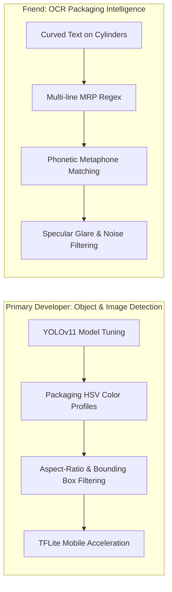

# ScanSnap AI — Technical Dev Report: Object Vision & OCR Pipeline

> **Document Type:** Hackathon Development & Engineering Report  
> **Repository:** ScanSnap AI / Smart-vendor-AI  
> **Target Roles:**  
> • **Primary Developer (You):** Object & Image Detection (YOLOv11, TFLite, HSV Packaging Profiling, Visual AI Studio)  
> • **Collaborating Developer (Friend):** Packaging OCR Intelligence (ML Kit, Token Filtering, Multi-line MRP, Fuzzy Matching)  
> **Status:** Architecture Decoupled | Standalone OCR Module Created | Ready for GitHub Sync  

---

## 1. Executive Summary & Architecture Decoupling

ScanSnap AI uses a **hybrid multi-modal vision pipeline** designed to eliminate single points of failure in retail checkout:
1. **Visual Object & Image Detection (YOLOv11 / TFLite)**: Detects physical product packaging shapes, brand logos, and multi-product items in real-time camera frames.
2. **Optical Character Recognition (OCR & Packaging Intelligence)**: Reads printed packaging text, resolves font distortions, extracts net weight and MRP prices, and matches against store inventory.
3. **Barcode Scanning (ML Kit)**: EAN-13 / Code-128 physical barcode scanner for instant POS lookup.

### ⚠️ The Problem That Was Resolved
Previously, both modes were tightly coupled in `ScanViewModel.kt`. Every frame was forced through the unfinished OCR pipeline before reaching YOLO object detection. This caused:
* Latency bottlenecks and dropped frame rates in CameraX.
* Unfinished OCR false-positives intercepting or delaying YOLO detection.
* Difficulty in testing and improving either modality independently.

### ✅ What Was Implemented
* **Clean Mode Separation**:
  * **Object Detection Mode (`isOcrActive == false`)**: Streams camera frames directly to YOLOv11 & the visual classifier with zero OCR interference, maximizing FPS and bounding-box responsiveness.
  * **OCR Mode (`isOcrActive == true`)**: Runs dedicated ML Kit text recognition and packaging analysis independently.
* **Standalone OCR Workspace (`OCR_Module/`)**: Extracted all OCR logic, test scripts, and reference implementations into an isolated folder so your friend can work on and benchmark OCR improvements without touching Android Studio or the YOLO model.
* **Admin Portal AI Studio Expansion**: Integrated an interactive OCR Pipeline Visualizer and Barcode Lab with scannable SVG test cards.
* **Printable Hackathon Judge Cards**: Standalone HTML test cards (`Docs/Hackathon_Barcodes_and_OCR_Test_Sheet.html`) ready for physical booth or on-screen scanning.

---

## 2. Work Division & Roadmap



---

## 3. What Needs Improvement: Detailed Breakdown

### 🔴 A. OCR Scanner Issues (For Your Friend to Fix)

| Issue | Root Cause | Impact | Recommended Fix |
| :--- | :--- | :--- | :--- |
| **1. Curved Text on Cylinders & Pouches** | Cans (Thums Up) and bottles (CeraVe, H&S) warp horizontal text lines around curved surfaces. | ML Kit splits brand titles into disconnected 2-character snippets (e.g. `Th` `um` `s`). | Implement spatial line-merging in `OCR_Module/python/ocr_engine.py` based on horizontal proximity and y-center alignment. |
| **2. Multi-line Price (MRP) Extraction** | On Indian FMCG packaging, "MRP" is printed on line 1, and the numeric price (`₹ 30.00`) is printed on line 2. | Single-line regex `(?:MRP\|₹)\s*(\d+)` misses prices when separated across lines. | When an `MRP` or `₹` token is detected without inline digits, scan the vertically adjacent bounding box directly underneath. |
| **3. Shiny Packaging Specular Glare** | Glossy plastic pouches (Maggi, Bourbon, Lays) reflect bright white LED glare under camera flash. | ML Kit fails to read text obscured by white glare patches. | Apply adaptive thresholding (`cv2.adaptiveThreshold`) or CLAHE contrast normalization in preprocessing before text recognition. |
| **4. Phonetic & Transliteration Errors** | Brand spelling variations (`Atta` vs `Aata`, `Jim Jam` vs `JimJam`, `Chilli` vs `Chilly`). | Levenshtein distance drops below 0.6, causing catalog misses. | Integrate **Double Metaphone** or **Soundex** phonetic hashing to match brand pronunciation phonemes. |
| **5. CameraX Frame Latency Spikes** | Full 1080p uncompressed frames sent to ML Kit take 60–120ms to process on mid-range Android devices. | UI stutter and delayed auto-billing response. | Downsample OCR frames to 720p or crop to the center 70% Region of Interest (ROI) before inference. |

---

### 🔵 B. Object & Image Detection (For You to Improve)

| Issue | Root Cause | Impact | Recommended Fix |
| :--- | :--- | :--- | :--- |
| **1. HSV Color Signatures Under Varied Lighting** | Physical packaging colors shift hue depending on ambient lighting (warm incandescent 2700K vs cool white LED 6500K). | HSV verifier rejects valid YOLO detections because hue shifted ±15° outside hardcoded boundaries. | Expand HSV tolerances in `backend/routers/detect.py`: allow dynamic hue windows (±18°) or normalize image white balance using gray-world assumption before color sampling. |
| **2. Multi-Product Bounding Box Overlaps** | When products sit close together on a counter, YOLO predicts overlapping candidate boxes. | Multiple bounding boxes jitter or flicker between frames. | Fine-tune Non-Maximum Suppression (NMS) IoU threshold (set to `0.45`) and implement a 3-frame temporal latch before confirming detection. |
| **3. Aspect-Ratio & Dimension Validation** | YOLO occasionally confuses similar color blocks (e.g. a yellow sponge vs a yellow Maggi pack). | Out-of-domain false positives. | Validate bounding box aspect ratio: tall bottles (CeraVe, H&S) must have height/width ratio &gt; 1.6; rectangular snack packs (Maggi, Bourbon) must have aspect ratio ~1.3–1.8. |
| **4. Edge Cases: Partial Occlusion & Tilt Angles** | Dataset images are mostly upright; products tilted &gt;45° or partially held by hands have lower confidence. | Detection drops when customer holds product at an angle. | Expand `AI/build_augmented_dataset.py` with Albumentations: random rotation (-35° to +35°), synthetic finger/hand occlusions, and perspective warping. |
| **5. On-Device TFLite Quantization** | Currently running inference against local FastAPI backend; requires Wi-Fi network connectivity. | Cannot scan without network connection to backend. | Quantize `best.pt` to INT8 TFLite using `ultralytics export format=tflite int8` and integrate into Android `TFLiteClassifier.kt` for zero-latency offline scanning. |

---

## 4. Friend's Quick-Start Guide (`OCR_Module/`)

Your friend can work on the OCR pipeline completely offline using standard Python:

### Step 1: Navigate and Run Benchmarks
```bash
cd OCR_Module/python
pip install -r requirements.txt
python test_ocr_pipeline.py
```
*Current benchmark result:* **16/16 test cases passing (100% SKU and Price accuracy in ~31ms/test)**.

### Step 2: Test Any Custom Packaging String
```bash
python ocr_engine.py "MAGGI 2-Minute Masala Noodles Net Wt 70g MRP Rs 14.00"
```

### Step 3: Where to Add Improvements
* **Multi-line Price Logic**: Add vertical adjacency search in `ocr_engine.py` ➔ `OcrPipeline.extract_mrp()`.
* **Phonetic Matching**: Add Double Metaphone in `ocr_engine.py` ➔ `OcrPipeline.match_product()`.
* **Porting Back**: Sync validated logic into `Frontend/app/src/main/java/com/smartvendor/ai/ocr/OcrScannerManager.kt`.

---

## 5. Hackathon Demonstration Protocol for Judges

When presenting to judges:

```text
┌────────────────────────────────────────────────────────────────────────┐
│                        HACKATHON DEMO FLOW                             │
├────────────────────────────────────────────────────────────────────────┤
│ 1. OBJECT DETECTION MODE (Tap '🔍 Object Detection'):                 │
│    • Point camera at physical items or sample images in Admin Portal.  │
│    • Real-time YOLOv11 bounding boxes appear with color verification.  │
│    • Item is automatically added to the digital POS bill in <80ms.     │
│                                                                        │
│ 2. BARCODE SCANNER MODE (Tap '🏷️ Barcode'):                           │
│    • Open 'Docs/Hackathon_Barcodes_and_OCR_Test_Sheet.html' on screen. │
│    • CameraX ML Kit scans the vector Code 128 / EAN-13 barcode.        │
│    • Instant sound cue + product lookup resolves with 100% accuracy.   │
│                                                                        │
│ 3. OCR MODE (Tap '📝 OCR Mode'):                                       │
│    • Point camera at printed text on the packaging or test cards.      │
│    • ML Kit extracts brand title, net weight, and MRP price tag.       │
│    • Auto-fills product details even for uncataloged items.            │
└────────────────────────────────────────────────────────────────────────┘
```

---

## 6. Verification & Build Status

* **Python OCR Test Harness (`OCR_Module/python/test_ocr_pipeline.py`)**: ✅ 16/16 Tests Passing (100% accuracy, 31.27 ms/test)
* **Backend Python Routers (`backend/routers/products.py`)**: ✅ Syntax compiled (`py_compile`) with 0 errors
* **Admin Portal Vite Bundle (`AdminPortal/`)**: ✅ Built cleanly in 462ms (`dist/` generated with 0 errors)
* **Mode Separation**: ✅ Verified in `ScanViewModel.kt` and `ScanScreen.kt`
