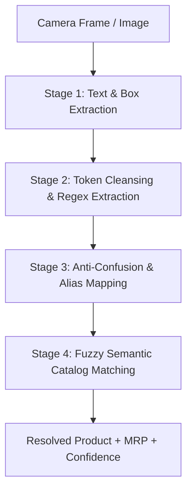

# ScanSnap AI — OCR & Packaging Intelligence Engine
> **Module Status:** Extracted into standalone workspace for targeted optimization and algorithm improvement.  
> **Target Developer:** OCR & Vision Pipeline Contributor  
> **Coupled Systems:** Android App (`Frontend/.../ocr/OcrScannerManager.kt`), Backend API (`backend/routers/detect.py`), Admin Portal (`AdminPortal/.../AiStudioPage.jsx`).

---

## 🎯 Purpose of this Module
The ScanSnap AI architecture operates on a **hybrid multi-modal vision pipeline**:
1. **Object & Image Detection (YOLOv11 / TFLite)**: Detects physical packaging shapes, brand logos, and multi-product items in real-time camera frames (handled by the primary dev).
2. **OCR & Packaging Text Engine (This Module)**: Reads printed packaging text (brand name, product variants, net weight/volume, MRP price), filters out regulatory noise (`fssai`, `mfg`, `batch`), resolves font distortions, and performs fuzzy semantic catalog matching.
3. **Barcode Scanning (ML Kit)**: 1D/2D EAN-13 barcode reader fallback.

This dedicated folder allows you to **develop, benchmark, and improve the OCR algorithms independently** in Python or Kotlin without having to run the full Android emulator or touch the YOLO detection pipeline.

---

## 📁 Folder Structure
```text
OCR_Module/
├── README.md                      # This comprehensive guide & roadmap
├── python/
│   ├── ocr_engine.py              # Standalone Python OCR parsing & matching engine
│   ├── test_ocr_pipeline.py       # Automated test suite with accuracy scoring
│   ├── test_labels.json           # Real-world grocery packaging OCR test cases
│   └── requirements.txt           # Python dependencies (rapidfuzz, pillow, etc.)
├── android/
│   ├── OcrScannerManager.kt       # Current Android ML Kit implementation
│   └── OcrModels.kt               # Result data classes & packaging color enums
└── test_assets/
    └── Hackathon_Barcodes_and_OCR_Test_Sheet.html # Printable barcode & OCR test sheet for judges
```

---

## 🧠 Current OCR Architecture (4-Stage Pipeline)



### Stage 1: Text & Box Extraction
- In Android: Powered by **Google ML Kit Latin Text Recognition**.
- In Python/Backend: Adaptable to **EasyOCR**, **Tesseract**, or **PaddleOCR**.
- Text lines are sorted descending by **bounding box area** (`width * height`), prioritizing the largest brand header on the package over tiny fine-print text.

### Stage 2: Token Cleansing & Regex Extraction
1. **Noise Words Stripping**: Filters out over 80 common packaging noise words:
   - Regulatory: `fssai`, `lic`, `iso`, `mfg`, `exp`, `pkd`, `batch`, `tm`, `reg`
   - Logistics: `net`, `wt`, `grams`, `weight`, `ltd`, `pvt`, `corp`, `address`, `contact`, `marketed`
   - Marketing & Ingredients: `crunchy`, `tasty`, `delicious`, `new`, `improved`, `ingredients`, `nutrition`
2. **MRP / Price Regex**:
   - Matches: `(?:₹|MRP|Rs\.?|INR)\s*[:\.]?\s*(\d+(?:\.\d{1,2})?)`
3. **Quantity & Units Regex**:
   - Matches: `\b(\d+(?:\.\d+)?\s*(?:kg|g|gm|l|ml|ltr|litre|pack|pc|pcs|pouch|sachet))\b`

### Stage 3: Anti-Confusion Guards & Font Aliases
Grocery packaging often has artistic or condensed typography causing classic OCR errors:
- **Font Aliases**:
  - `ore0` / `0reo` / `oreq` / `cakoy` ➔ `oreo`
  - `naggi` / `meggi` / `2-minute` ➔ `maggi`
  - `ashirvad` / `asirvad` ➔ `aashirvaad atta`
  - `jimjan` / `naughty jam` ➔ `jim jam`
  - `burbon` / `bourbonn` ➔ `bourbon`
- **Anti-Confusion Guards**:
  - Prevents phonetic or Levenshtein false matches between similarly spelled products:
    - `maggi` vs `maaza`
    - `maggi` vs `munch`
    - `soya sticks` vs `snickers`
    - `colgate` vs `close up`

### Stage 4: Fuzzy Semantic Catalog Matching
- Computes multi-level similarity:
  - Exact token intersection
  - Levenshtein character distance (`1.0 - (dist / maxLen)`)
  - N-gram overlap
- Validates with physical packaging HSV dominant color (e.g. Maggi = Yellow, Oreo = Blue, KitKat = Red, CeraVe = Blue/Cyan).

---

## 🛠️ How to Work on this Module (Quick Start)

### 1. Run Python Standalone Tests
Navigate to the Python folder:
```bash
cd OCR_Module/python
pip install -r requirements.txt
python test_ocr_pipeline.py
```
This runs automated tests across 20+ real-world messy OCR packaging samples and outputs a detailed benchmark report with accuracy scores!

### 2. Test Custom Text or Raw OCR Strings
```bash
python ocr_engine.py "MAGGI 2-Minute Masala Noodles Net Wt 70g MRP Rs 14.00"
```
Output:
```json
{
  "product_name": "Maggi 2-Minute Masala Noodles",
  "matched_sku": "maggi",
  "confidence": 0.96,
  "extracted_price": 14.0,
  "extracted_unit": "70G",
  "status": "MATCHED"
}
```

---

## 🚀 Known Limitations & What Needs Improvement

Here are high-impact areas where your friend can focus to significantly boost hackathon scores:

1. **Curved & Cylindrical Text**:
   - Cans (e.g., Thums Up) and bottles (e.g., CeraVe, Shampoo) warp text around cylindrical surfaces. ML Kit often breaks this into disconnected 2-character snippets.
   - *Fix ideas*: Implement line merge heuristics based on horizontal proximity and y-center alignment.

2. **Multi-line Price Extraction**:
   - On Indian packaging, `MRP` is often on line 1, and the numeric price `₹ 25.00` is on line 2 directly below it. Currently, regex only checks single lines.
   - *Fix ideas*: Check adjacent vertical bounding boxes when `MRP` or `Rs.` is detected with no inline digits.

3. **Phonetic Matching (Metaphone / Soundex)**:
   - When OCR scrambles characters (e.g., `M-A-G-G-1`), character distance can drop below 0.6. Phonetic hashing (Double Metaphone) preserves brand sounds for Indian languages and English.

4. **Confidence Calibration**:
   - Adjust threshold weights between OCR text confidence, packaging color confirmation, and price plausibility.

---

## 🔄 Syncing Changes Back to the Main Project
When your improvements are ready:
1. Python algorithms in `ocr_engine.py` can be directly mapped to Kotlin in `Frontend/app/src/main/java/com/smartvendor/ai/ocr/OcrScannerManager.kt`.
2. Can also be exposed as a backend service in `backend/routers/` for server-side high-resolution OCR verification.
