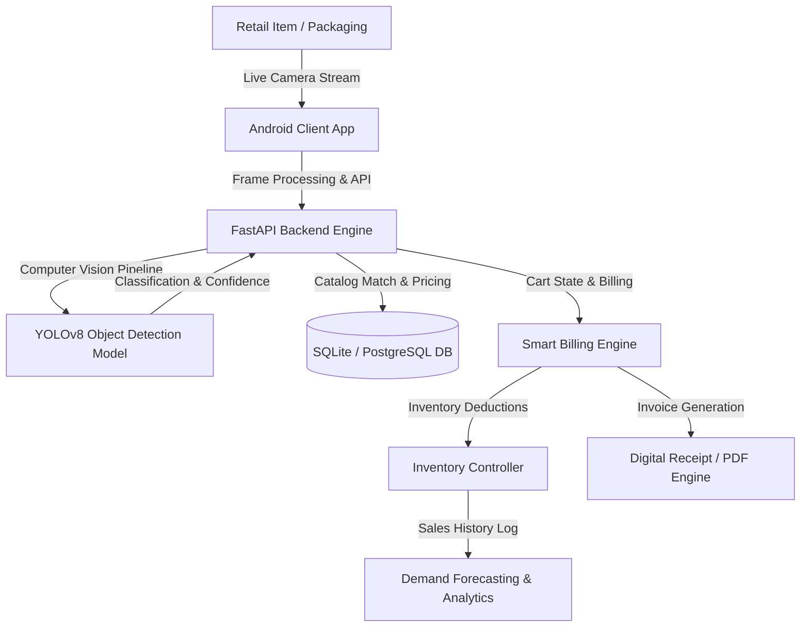

# 🛒 ScanSnap AI

> **Transforming any Android smartphone into an AI-powered Point of Sale (POS) & Smart Retail Inventory Management System.**

[](https://github.com/Abhrxdip)
[](https://github.com/Abhrxdip/Scansnap_Ai)
[](https://github.com/Abhrxdip/Scansnap_Ai)
[](LICENSE)

---

## 📖 Overview

**ScanSnap AI** is an intelligent, camera-first retail automation assistant designed to turn any standard Android smartphone into a complete, standalone Point of Sale (POS) and inventory intelligence terminal. 

Small retailers, Kirana shops, bakeries, and local grocery stores often struggle with the steep capital expenses and maintenance overhead of dedicated barcode scanners, thermal POS hardware, and complex desktop software. **ScanSnap AI** replaces expensive hardware with real-time Computer Vision and deep learning, enabling instant item recognition directly via camera feed, automated bill calculation, real-time inventory deductions, predictive restocking alerts, and multi-channel digital receipt sharing.

---

## ✨ Key Highlights & Features

- 📸 **Camera-Based Instant Product Recognition**: Point the camera at any item; YOLOv8 deep learning recognizes products without manual barcode scanning.
- ⚡ **Automated Smart Billing**: Fast item cart additions, dynamic tax/GST calculations, discount modifiers, and quick checkout flow.
- 📦 **Live Inventory & Master Catalog**: Pre-seeded with thousands of common retail products with automatic stock decrementing and low-threshold alerts.
- 📊 **Business & Sales Analytics**: Comprehensive dashboards tracking daily, weekly, and monthly revenue, bestsellers, and peak sales hours.
- 📈 **Predictive Stock Demand Forecasting**: Machine learning algorithms forecasting inventory needs based on historical sales trends.
- 🧾 **Digital Receipts**: Instant PDF bill generation and native one-tap WhatsApp / SMS receipt dispatch.
- 🔌 **Offline-Resilient Architecture**: Continue basic transactions offline with automatic background sync upon reconnection.

---

## 🏗️ Architecture & Workflow



---

## 🛠️ Technology Stack

### **Mobile App (Frontend)**
- **Language**: Kotlin
- **Architecture**: MVVM with Repository Pattern, LiveData & Coroutines
- **UI & Graphics**: Material 3 / Android Jetpack UI
- **Camera & Networking**: CameraX, Retrofit2, OkHttp3

### **Backend & APIs**
- **Framework**: FastAPI (Asynchronous Python REST API)
- **ORM & Database**: SQLAlchemy, SQLite (Dev) / PostgreSQL (Prod)
- **Validation**: Pydantic v2

### **AI / Computer Vision & Machine Learning**
- **Vision Model**: Ultralytics YOLOv8 (Custom Trained on Retail Packaged Goods)
- **Image Processing**: OpenCV, NumPy, Pillow
- **Forecasting**: Scikit-Learn

---

## 📂 Project Structure

```
Scansnap_Ai/
├── AI/                     # Dataset annotations, YOLO training scripts, pipeline
│   ├── dataset/            # Retail image dataset batches and labels
│   └── test.py             # Model inference & accuracy validation scripts
├── backend/                # FastAPI backend service
│   ├── models/             # Pretrained YOLO model weights (best.pt)
│   ├── routers/            # API endpoints (products, bills, analytics, detect, catalog)
│   ├── auth.py             # User & authentication middleware
│   ├── database.py         # SQLAlchemy engine & session manager
│   ├── main.py             # FastAPI entrypoint
│   ├── models.py           # SQLAlchemy database tables
│   ├── schemas.py          # Pydantic data schemas
│   └── requirements.txt    # Python dependencies
├── Frontend/               # Native Android application
│   ├── app/                # Application module, source code, and resources
│   │   ├── src/main/java/com/smartvendor/ai/  # Core Kotlin business logic
│   │   └── src/main/res/   # UI Layouts, strings, themes, and drawables
│   └── build.gradle.kts    # Gradle build configurations
└── Docs/                   # System documentation & guidelines
```

---

## 🚀 Getting Started

### 1. Backend Setup

```bash
cd backend
python -m venv .venv
source .venv/bin/activate  # On Windows: .venv\Scripts\activate
pip install -r requirements.txt

# Run the FastAPI server
uvicorn main:app --host 0.0.0.0 --port 8000 --reload
```

Interactive API documentation will be available at `http://localhost:8000/docs`.

### 2. Android App Setup

1. Open the `Frontend` folder in **Android Studio**.
2. Sync Gradle files.
3. Configure your backend server URL in `network/ApiClient.kt`.
4. Build and run on an Android device or emulator (Android 8.0+ / API level 26+ recommended).

---

## 👨‍💻 Author

* **Abhradip Pal** - [@Abhrxdip](https://github.com/Abhrxdip)

---

## 📄 License

This project is licensed under the MIT License - see the [LICENSE](LICENSE) file for details.
