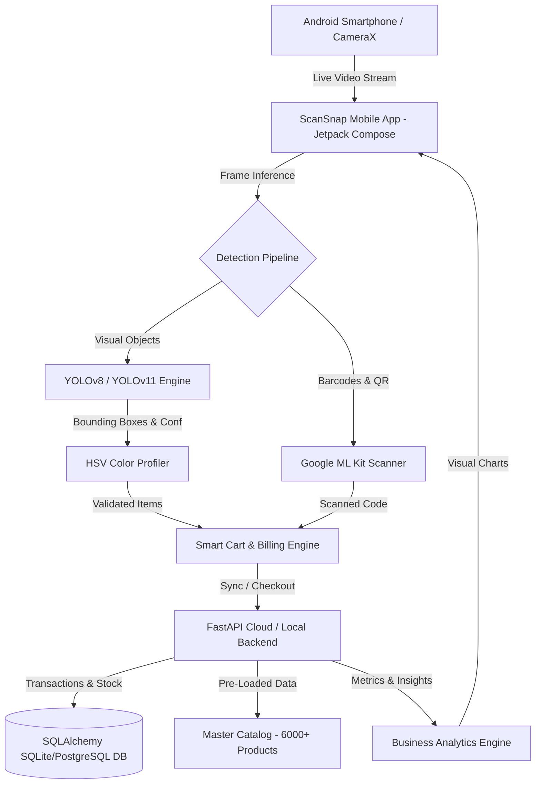

# 🛍️ ScanSnap AI (Smart Vendor AI)
> **Next-Generation Edge AI-Powered Smart POS, Object Detection Billing & Inventory Intelligence for Micro-Retailers**

[](https://fastapi.tiangolo.com/)
[](https://kotlinlang.org/)
[](https://developer.android.com/jetpack/compose)
[](https://ultralytics.com)
[](https://pytorch.org/)
[](https://www.sqlite.org/)

---

## 📌 Executive Summary
**ScanSnap AI** transforms any standard Android smartphone into a high-speed, AI-powered Smart Point-of-Sale (POS) terminal and inventory intelligence hub. Built specifically for Kirana stores, micro-vendors, and retail kiosks, ScanSnap AI eliminates long checkout queues and tedious manual barcode lookups by combining **real-time Computer Vision (YOLO)**, **HSV Packaging Color Signature Verification**, **ML Kit Barcode Scanning**, and an automated **FastAPI Inventory & Analytics Backend**.

---

## 🎯 The Problem & Our Solution

### 🚩 The Problem
- **Slow Checkout Queues:** Manual entry or barcode hunting slows down billing during peak retail hours.
- **Damaged or Missing Barcodes:** Damaged FMCG packaging causes scanner failures and frustration.
- **Expensive Hardware POS:** Commercial POS systems require dedicated hardware, laser scanners, and costly subscriptions ($500+).
- **Inventory Blind Spots:** Small retailers struggle to track stock depletion, leading to lost sales and expired stock.

### 💡 The ScanSnap AI Solution
- **Visual AI Object Detection:** Point the camera at any grocery item (e.g., Maggi, Surf Excel, Oreo) for sub-50ms instant detection and cart addition.
- **Zero Expensive Hardware:** Runs natively on existing Android smartphones with CameraX and on-device/backend inference.
- **Sub-Millisecond Color Verification:** Proprietary HSV color profile validation eliminates false positives across visually distinct packaging.
- **Pre-Seeded Catalog:** Comes pre-loaded with **6,000+ Indian retail FMCG items** for instant zero-setup onboarding.
- **Real-Time Analytics & Reports:** Instant revenue tracking, top-selling product metrics, payment breakdowns (Cash vs UPI), and automated low-stock warnings.

---

## 🏗️ System Architecture



---

## ✨ Key Features

### 1. 🔍 Dual-Mode Hybrid Scanner
- **Computer Vision Recognition:** Detects packaged goods instantly using fine-tuned lightweight YOLO models (`best.pt` / `yolo11n.pt`).
- **Physical Color Profile Verification:** HSV-space color signature checking (<0.5ms) ensures accurate classification and rejects out-of-domain false positives.
- **Barcode & 2D Code Scanning:** Built-in ML Kit fallback for high-density barcodes and QR codes.

### 2. ⚡ Smart Fast Billing
- Real-time cart management with quantity adjustments, auto-calculated tax/GST, and one-tap checkout.
- Support for multiple payment modes: **Cash**, **UPI QR Integration**, and **Card**.
- Instant digital receipt generation with unique invoice IDs.

### 3. 📦 Master Catalog & Inventory Management
- Pre-seeded database with **6,000+ popular Indian retail items** categorized by snacks, beverages, household essentials, personal care, and dairy.
- Real-time stock decrement upon sale completion.
- Automated **Low-Stock Alert Badges** when inventory dips below safety thresholds.

### 4. 📊 Sales Analytics & Retail Intelligence
- Revenue dashboard with customizable time filters (Today, Yesterday, Last 7 Days, Last 30 Days).
- Breakdown of **Top 5 Best-Selling Products** by units sold and gross revenue.
- Visual sales velocity trends and transaction history logs.

---

## 🛠️ Technology Stack

| Layer | Technologies Used |
| :--- | :--- |
| **Mobile App (Frontend)** | Android (Kotlin), Jetpack Compose, CameraX, Coroutines & Flow, Retrofit2, OkHttp3, Navigation Compose |
| **Computer Vision & AI** | YOLOv8 / YOLO11 (Ultralytics), PyTorch, OpenCV/Pillow, NumPy HSV Color Signature Profiling, Google ML Kit |
| **Backend API** | FastAPI (Python 3.10+), Pydantic v2, Uvicorn, SQLAlchemy ORM |
| **Database** | SQLite (Development/Local Edge) / PostgreSQL (Production) |
| **Tools & Architecture** | MVVM Clean Architecture, REST API, Git, Gradle KTS |

---

## 📂 Repository Structure

```
Smart-vendor-AI/
├── AI/                          # Model training scripts, weights & datasets
│   ├── yolo11n.pt               # YOLOv11 base weights
│   ├── yolo26n.pt               # Fine-tuned model checkpoint
│   ├── requirements.txt         # AI pipeline dependencies
│   └── dataset/                 # Training and validation annotations
├── backend/                     # FastAPI backend application
│   ├── main.py                  # Server entry point & CORS configuration
│   ├── database.py              # SQLAlchemy DB session & engine
│   ├── models.py                # Database tables (Product, Bill, StoreProfile, MasterCatalog)
│   ├── schemas.py               # Pydantic validation schemas
│   ├── auth.py                  # Authentication & user dependency
│   ├── seed_6000_indian_products.py # 6000+ Indian retail dataset seeder
│   ├── seed_master_catalog.py   # Master catalog initialization script
│   ├── models/best.pt           # Deployed YOLO inference model
│   └── routers/
│       ├── detect.py            # YOLO inference + HSV color signature verification
│       ├── products.py          # Inventory CRUD endpoints
│       ├── bills.py             # Billing & checkout engine
│       ├── analytics.py         # Business intelligence & revenue analytics
│       ├── catalog.py           # Master catalog search & lookup
│       └── store.py             # Store profile & GST/UPI settings
├── Frontend/                    # Native Android Mobile Application
│   ├── app/src/main/java/com/smartvendor/ai/
│   │   ├── activities/          # MainActivity & SplashActivity
│   │   ├── ai/                  # DetectionOverlayView, TFLiteClassifier, YoloUtils
│   │   ├── network/             # Retrofit API clients & endpoints
│   │   ├── repository/          # Repository data layer
│   │   ├── ui/screens/          # Compose Screens (Scan, Billing, Inventory, Dashboard, Reports)
│   │   └── ui/theme/            # Color palettes, typography & themes
│   └── build.gradle.kts         # Android Gradle build scripts
└── README.md                    # Project documentation
```

---

## 🚀 Getting Started

### 1. Backend Setup
```bash
# Navigate to backend directory
cd backend

# Create virtual environment
python -m venv venv
# On Windows:
.\venv\Scripts\activate
# On Linux/macOS:
source venv/bin/activate

# Install dependencies
pip install -r requirements.txt

# Seed the master catalog with 6,000+ Indian products
python seed_6000_indian_products.py

# Start the FastAPI server
uvicorn main:app --host 0.0.0.0 --port 8000 --reload
```
API Documentation will be accessible at: `http://localhost:8000/docs`

### 2. Android App Setup
1. Open the `Frontend` directory in **Android Studio** (Hedgehog or newer).
2. Configure your computer's local IP address in the network configuration file (`ApiConstants.kt` or `network/`).
3. Connect your Android device via USB (with Developer Options & USB Debugging enabled) or start an Emulator with camera support.
4. Click **Run 'app'** (`Shift + F10`).

---

## 📡 Key API Endpoints

| Method | Endpoint | Description |
| :--- | :--- | :--- |
| `POST` | `/detect/` | Upload image frame for YOLO detection & HSV verification |
| `GET` | `/products/` | Fetch store inventory with pagination & search |
| `POST` | `/products/` | Add new product to store stock |
| `POST` | `/bills/` | Create a new completed bill transaction |
| `GET` | `/bills/` | Retrieve past sales transaction history |
| `GET` | `/analytics/summary` | Get aggregated revenue, top products & low-stock alerts |
| `GET` | `/catalog/search` | Search from 6,000+ pre-seeded master retail catalog |
| `GET` | `/store/profile` | Retrieve store GST, address, and UPI configurations |

---

## 👥 Contributors & License
- Developed by **Abhradip Pal** & Team
- Licensed under the [MIT License](LICENSE)
