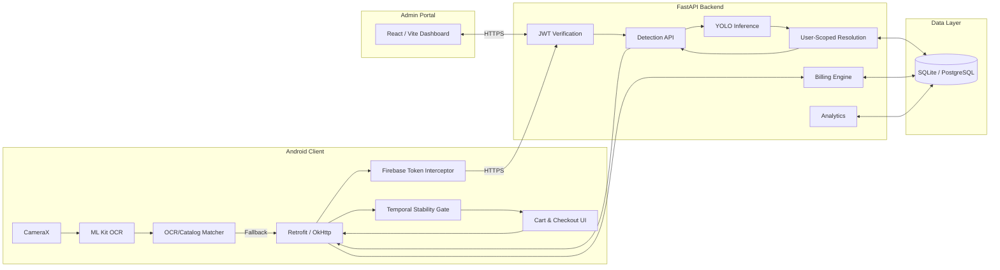
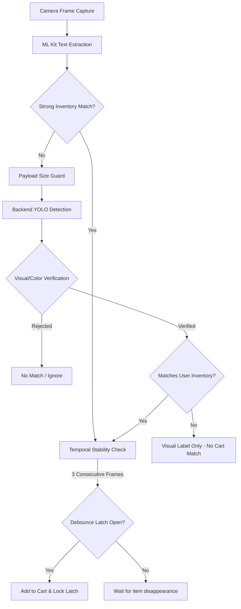
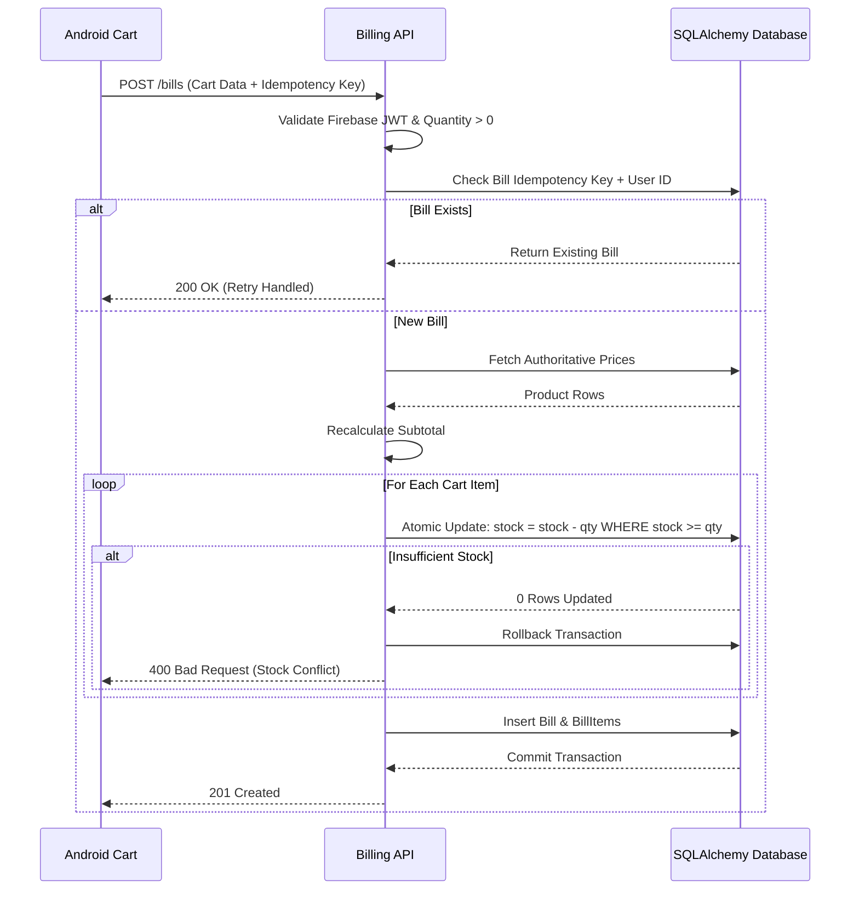
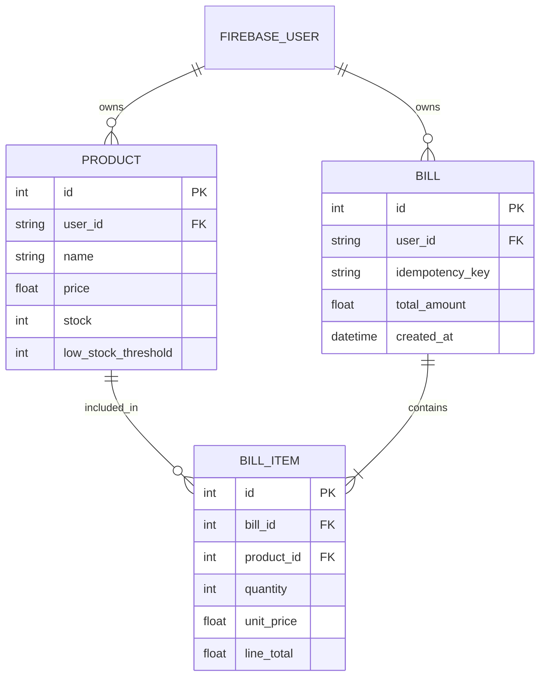

# ScanSnap AI

### Camera-first AI retail billing and inventory intelligence

ScanSnap AI is an experimental intelligent retail billing platform that combines Android camera input, hybrid optical and object recognition, inventory-aware product matching, secure checkout, stock management, and analytics into a cohesive mobile point-of-sale workflow.


---

## 1. The Problem

Traditional small-retail billing relies heavily on barcodes, dedicated scanning hardware, and manually maintained POS catalogs. This workflow presents friction:
- **Barcode Dependency:** Damaged, missing, or folded barcode labels halt the checkout process.
- **Hardware Friction:** SMB retailers must invest in dedicated hardware scanners or complex POS registers.
- **Manual Search:** When scans fail, cashiers revert to slow manual item lookup.
- **Siloed Workflows:** Inventory decrement and billing often exist as disconnected processes in smaller retail environments.

## 2. The Solution

ScanSnap AI replaces dedicated barcode hardware with a standard Android camera utilizing a hybrid recognition pipeline. The user points their smartphone at a packaged retail product, and the system attempts to understand it using multiple visual signals. 

Rather than relying purely on one modality, it combines Optical Character Recognition (OCR), semantic catalog matching, YOLO object detection, and visual packaging cues. These recognitions are securely tethered to a backend inventory system to deduct stock and generate analytics safely.

---

## 3. Core Capabilities

| Capability | Implementation | Why It Matters |
| :--- | :--- | :--- |
| **Hybrid Scanning** | CameraX + ML Kit OCR + YOLO Detection fallback | Mitigates single-point-of-failure in pure barcode/OCR systems. |
| **Inventory-Aware AI** | Recognitions resolve strictly against the authenticated user's database inventory. | Prevents billing fake or unowned products. |
| **Temporal Stability** | 3-frame continuous observation requirement. | Suppresses rapid erratic bounding box false-positives. |
| **Secure Checkout** | Idempotency keys + Atomic SQL stock deduction. | Prevents double-billing during network retries or concurrent checkout. |
| **Authoritative Pricing** | Item prices override client requests via backend database lookups. | Enforces strict financial integrity against modified clients. |
| **Strict Tenant Isolation** | Queries aggressively scoped via `models.Product.user_id == user_id`. | Secures private store analytics and billing history across vendors. |
| **Business Analytics** | Backend aggregation of daily revenue, top products, and velocity. | Provides actionable retail intelligence without manual exporting. |

---

## 4. How Product Recognition Works

Recognition confidence is not equivalent to transaction confidence. ScanSnap AI layers model confidence with inventory resolution, ambiguity handling, and temporal stability before allowing cart actions.

### Stage 1 — Camera Frame
The Android client utilizes CameraX to capture high-resolution preview frames of the checkout counter.

### Stage 2 — OCR extraction
Google ML Kit processes the frame locally to extract text blocks, mitigating network latency for highly legible packaging.

### Stage 3 — OCR Catalog Matching
Extracted text is normalized and compared against the authenticated user's inventory catalog. Ambiguous aliases (e.g., generic words like "milk" or "biscuit") are heavily penalized or rejected to prevent false positives.

### Stage 4 — YOLO Fallback & Visual Evidence
When OCR cannot confidently resolve a product, the frame is sent to the authenticated backend detection API. A fine-tuned YOLO model returns predicted classes, confidences, and bounding boxes. Packaging color within the bounding box acts as supporting evidence (where configured) to reject out-of-domain false positives.

### Stage 5 — User-Scoped Inventory Resolution
The detected YOLO label (e.g., `maggi`) attempts to resolve against the backend database. This search is strictly scoped to the authenticated user's inventory. If the user does not sell the item, the visual detection may still display on-screen, but the `product_match` resolves to `null`, architecturally preventing the cart from adding unowned inventory.

### Stage 6 — Temporal Stability
A single recognized frame does not trigger a cart addition. The Android client enforces a 3-consecutive-frame temporal stability threshold. Multiple bounding boxes of the same SKU within a single frame are correctly counted as one observation.

### Stage 7 — Cart Addition & Debouncing
Once stability conditions are met, the item is added to the local cart. A 5-second scanner cooldown and disappearance-latch prevent the same physical item from being continuously billed. The user must remove the item from the camera view to reset the latch for a second physical unit.

---

## 5. System Architecture


```mermaid
flowchart LR
    subgraph Mobile ["Android Client"]
        Camera["CameraX"]
        OCR["ML Kit OCR"]
        LocalMatcher["OCR/Catalog Matcher"]
        Stability["Temporal Stability Gate"]
        Cart["Cart & Checkout UI"]
        Network["Retrofit / OkHttp"]
        AuthInterceptor["Firebase Token Interceptor"]
    end

    subgraph Backend ["FastAPI Backend"]
        AuthLayer["JWT Verification"]
        DetectionAPI["Detection API"]
        YOLO["YOLO Inference"]
        ProductResolver["User-Scoped Resolution"]
        BillingAPI["Billing Engine"]
        AnalyticsAPI["Analytics"]
    end

    subgraph Data ["Data Layer"]
        DB[(SQLite / PostgreSQL)]
    end

    subgraph Admin ["Admin Portal"]
        ReactUI["React / Vite Dashboard"]
    end

    Camera --> OCR
    OCR --> LocalMatcher
    LocalMatcher -->|Fallback| Network
    Network --> AuthInterceptor
    AuthInterceptor -->|HTTPS| AuthLayer
    AuthLayer --> DetectionAPI
    DetectionAPI --> YOLO
    YOLO --> ProductResolver
    ProductResolver --> DetectionAPI
    DetectionAPI --> Network
    Network --> Stability
    Stability --> Cart
    Cart --> Network
    Network --> BillingAPI

    ProductResolver <--> DB
    BillingAPI <--> DB
    AnalyticsAPI <--> DB
    
    ReactUI <-->|HTTPS| AuthLayer
```

---

## 6. Recognition Pipeline


```mermaid
flowchart TD
    Capture[Camera Frame Capture] --> OCR[ML Kit Text Extraction]
    OCR --> Match{Strong Inventory Match?}
    Match -->|Yes| Stability[Temporal Stability Check]
    Match -->|No| PayloadCheck[Payload Size Guard]
    PayloadCheck --> Backend[Backend YOLO Detection]
    Backend --> Verify{Visual/Color Verification}
    Verify -->|Rejected| NoMatch[No Match / Ignore]
    Verify -->|Verified| DBResolve{Matches User Inventory?}
    DBResolve -->|No| Foreign[Visual Label Only - No Cart Match]
    DBResolve -->|Yes| Stability
    Stability -->|3 Consecutive Frames| Latch{Debounce Latch Open?}
    Latch -->|Yes| Cart[Add to Cart & Lock Latch]
    Latch -->|No| Wait[Wait for item disappearance]
```

---

## 7. Secure Checkout Flow


```mermaid
sequenceDiagram
    participant App as Android Cart
    participant API as Billing API
    participant DB as SQLAlchemy Database

    App->>API: POST /bills (Cart Data + Idempotency Key)
    API->>API: Validate Firebase JWT & Quantity > 0
    API->>DB: Check Bill Idempotency Key + User ID
    alt Bill Exists
        DB-->>API: Return Existing Bill
        API-->>App: 200 OK (Retry Handled)
    else New Bill
        API->>DB: Fetch Authoritative Prices
        DB-->>API: Product Rows
        API->>API: Recalculate Subtotal
        loop For Each Cart Item
            API->>DB: Atomic Update: stock = stock - qty WHERE stock >= qty
            alt Insufficient Stock
                DB-->>API: 0 Rows Updated
                API->>DB: Rollback Transaction
                API-->>App: 400 Bad Request (Stock Conflict)
            end
        end
        API->>DB: Insert Bill & BillItems
        DB-->>API: Commit Transaction
        API-->>App: 201 Created
    end
```

---

## 8. Data Model


```mermaid
erDiagram
    FIREBASE_USER ||--o{ PRODUCT : owns
    FIREBASE_USER ||--o{ BILL : owns
    PRODUCT ||--o{ BILL_ITEM : included_in
    BILL ||--|{ BILL_ITEM : contains

    PRODUCT {
        int id PK
        string user_id FK
        string name
        float price
        int stock
        int low_stock_threshold
    }
    BILL {
        int id PK
        string user_id FK
        string idempotency_key
        float total_amount
        datetime created_at
    }
    BILL_ITEM {
        int id PK
        int bill_id FK
        int product_id FK
        int quantity
        float unit_price
        float line_total
    }
```

---

## 9. Technology Stack

| Layer | Technology | Responsibility |
| :--- | :--- | :--- |
| **Mobile Client** | Kotlin, Jetpack Compose | Native UI, concurrency, and camera pipelines. |
| **Mobile Vision** | CameraX, Google ML Kit | Frame extraction and local on-device OCR. |
| **Mobile Network** | Retrofit2, OkHttp3 | REST communication and interceptor-based auth injection. |
| **Backend API** | Python 3.10+, FastAPI, Uvicorn | High-performance asynchronous REST gateway. |
| **Backend Vision** | Ultralytics YOLO, Pillow | Server-side bounding box prediction and image parsing. |
| **Database** | SQLAlchemy, SQLite | ACID-compliant ORM handling atomic transactions. |
| **Security** | Firebase Auth, Pydantic | JWT validation and strictly-typed payload schema enforcement. |
| **Admin Portal** | React, Vite | Web-based inventory configuration and business dashboards. |

---

## 10. Repository Structure

```text
ScanSnap_Ai/
+-- Frontend/                 # Native Android Client
¦   +-- app/src/main/java/... # Kotlin UI, AI Overlays, and Retrofit APIs
¦   +-- build.gradle.kts      # Gradle configuration (dynamic API base URLs)
¦   +-- AndroidManifest.xml   # Manifest (Cleartext configuration rules)
+-- backend/                  # FastAPI Application
¦   +-- routers/              # Modular API endpoints (detect, bills, analytics)
¦   +-- models.py             # SQLAlchemy ORM definitions
¦   +-- schemas.py            # Pydantic payloads
¦   +-- auth.py               # Firebase JWT validation layer
¦   +-- main.py               # Application entrypoint & CORS definition
+-- AdminPortal/              # React Web Dashboard
¦   +-- src/                  # Components, Pages, and Assets
+-- AI/                       # Model Weights & Training Notebooks
+-- README.md                 # Project Documentation
```

---

## 11. Backend API Overview

| Method | Endpoint | Auth Required | Purpose |
| :--- | :--- | :--- | :--- |
| `POST` | `/detect/image` | Yes | Multipart image upload for YOLO inference and user-scoped product matching. |
| `POST` | `/detect/base64` | Yes | Base64 JSON payload alternative for YOLO inference. |
| `POST` | `/bills/` | Yes | Submits a cart payload, executes atomic stock deduction, and returns receipt. |
| `GET` | `/bills/` | Yes | Retrieves user-scoped transaction history. |
| `GET` | `/products/` | Yes | Retrieves user-scoped inventory limits and pricing. |
| `GET` | `/analytics/summary` | Yes | Aggregates user-scoped revenue, top products, and restock warnings. |

---

## 12. Security & Transaction Integrity

ScanSnap AI employs stringent backend hardening to guarantee financial and data integrity:

- **Strict Identity Verification:** Firebase ID tokens are cryptographically verified by the backend utilizing `firebase-admin`. Unsigned JWT fallbacks are disabled.
- **Aggressive Tenant Isolation:** All Product queries, Bill creations, and Analytics aggregates dynamically enforce `models.Entity.user_id == user_id`.
- **Payload Safety Guards:** Detection endpoints aggressively intercept multipart uploads exceeding 4MB, Base64 strings exceeding ~6MB, or decompression dimension bombs exceeding 2000x2000px before allocating memory to PIL.
- **Checkout Integrity:** 
  - *Authoritative Computation:* Client-submitted prices are overridden by authoritative backend database lookups. 
  - *Atomic Deductions:* Concurrent transactions utilize conditional SQLAlchemy updates (`stock = stock - qty WHERE stock >= qty`) to prevent race conditions and negative inventory limits.
  - *Idempotency:* Network retries presenting an existing local `billId` are deterministically mapped to prevent duplicate stock deduction.
- **Environment Gating:** `/view-data` database dumps and unrestricted CORS origins are actively blocked in production unless an explicit `DEV_AUTH_BYPASS` variable is activated for local testing.

---

## 13. Competitive Landscape

*Competitive information checked on: October 2026 based on official vendor documentation.*

| Capability | ScanSnap AI | Zoho POS | Vyapar | GoFrugal | Square Retail | Scandit | Amazon Just Walk Out |
| :--- | :--- | :--- | :--- | :--- | :--- | :--- | :--- |
| **Primary Focus** | Camera-first SMB POS | Established POS | Indian SMB Accounting | Retail ERP/POS | Payment & Retail POS | Smart Data Capture SDK | Autonomous Store Infrastructure |
| **Barcode Scanning** | Supported | Yes | Yes | Yes | Yes | Advanced | N/A |
| **Unbarcoded Visual Product Recognition** | **Yes** | No | No | No | No | Not primary workflow | **Yes** (Sensor Fusion) |
| **Inventory-Aware Recognition** | **Yes** | N/A | N/A | N/A | N/A | N/A | Deep Integration |
| **Dedicated Hardware Required** | No (Android + Backend) | No (Platform dependent) | No | No | Varies (Square Registers) | No (SDK) | **Yes** (Ceiling cameras/sensors) |
| **Deployment Complexity** | Low | Low | Low | Moderate | Low | Moderate (App integration) | Extremely High |
| **Offline Billing** | Not Implemented | Yes | Yes | Yes | Yes | Yes | N/A |

### Strategic Differentiation
**Conventional POS Systems (Vyapar, Square, Zoho):** Offer mature offline billing, taxation ecosystems, and payment gateways, but rely fundamentally on traditional barcode scanning or manual search constraints.
**Smart Capture SDKs (Scandit):** Offer world-class enterprise OCR/Barcode scanning but exist as software components requiring custom POS integration.
**Autonomous Checkout (Amazon JWO):** Achieves zero-friction checkout but demands massive capital expenditure in store infrastructure and ceiling sensors.

**ScanSnap AI** explores the middle ground: directly connecting an experimental, camera-first visual recognition pipeline to a standard SMB retail inventory structure using commodity smartphone hardware. 

---

## 14. Demo Workflow

1. **Sign in** via Firebase Authentication.
2. **Add inventory** in the Admin Portal or App.
3. **Open scanner** on Android device.
4. **Present product** to the camera.
5. **OCR attempts recognition**, falling back to YOLO and visual verifiers if confidence is low.
6. **Stable product is added** to the cart once 3 consecutive frames observe the matched, user-owned item.
7. **Increment quantity** by repeatedly removing and re-presenting physical units to pass the disappearance latch.
8. **Checkout**, wherein the backend atomically validates prices and stock deductions.
9. **Inventory decreases** and the Analytics dashboard immediately reflects the transaction.

---

## 15. Setup Instructions

### Backend (FastAPI)
```bash
cd backend
python3 -m venv venv
source venv/bin/activate  # Or .\venv\Scripts\activate on Windows
pip install -r requirements.txt

# Seed the master catalog (optional)
python seed_6000_indian_products.py

# Execute the server
uvicorn main:app --host 0.0.0.0 --port 8000 --reload
```
API Documentation will be accessible at: `http://localhost:8000/docs`

### Android Client
1. Open the `Frontend` directory in Android Studio.
2. The `build.gradle.kts` utilizes `BuildConfig` to manage the API Base URL. 
   - `debug` builds default to a local testing IP (e.g., `192.168.x.x`). 
   - `release` builds read the production placeholder.
3. Configure `google-services.json` in the app directory.
4. Build and deploy via Android Studio (note: the headless `gradlew` wrapper is currently omitted from the repository root).

### Admin Portal
```bash
cd AdminPortal
npm install
npm run dev
```

---

## 16. Environment Variables & Deployment

| Variable | Environment | Purpose |
| :--- | :--- | :--- |
| `ALLOWED_ORIGINS` | Production Backend | Comma-separated list of permitted CORS origins (e.g., `https://admin.yourdomain.com`). Defaults to `[]`. |
| `DEV_AUTH_BYPASS` | Local Backend | If `true`, enables the `/view-data` debug route and permits local `localhost:3000` CORS testing. |
| `API_BASE_URL` | Android build.gradle | Injects the active HTTPS endpoint into Retrofit during compile time. |

### Production Deployment Checkpoints (Blockers)
- [ ] **Configure Production API URL:** The Android release configuration currently holds a placeholder domain (`https://api.smartvendor.example.com/`). A real domain must be injected before releasing the APK.
- [ ] **Disable Dev Auth Bypass:** Ensure `DEV_AUTH_BYPASS` is unset in the production environment.
- [ ] **Configure Allowed Origins:** Supply the real Admin Portal URL to the `ALLOWED_ORIGINS` backend variable.
- [ ] **Inject Firebase Credentials:** Provide `firebase-adminsdk.json` to the backend deployment and `google-services.json` to the Android build.

---

## 17. Testing & Validation Status

**Source-Level Validation Completed:**
- Python compilation and schema integrity verification.
- SQLAlchemy concurrency transaction rollback testing.
- Comprehensive security audit (zero stale `verify_signature=False` patterns, isolated logging, safe Android cleartext placeholders).

**Runtime Validation Pending:**
- Extensive physical-device camera benchmarking (Confusion Matrix / OCR latency matrices). 
*(Note: As an experimental repository, empirical 100-scan accuracy measurements across diverse lighting conditions remain pending human physical QA testing).*

---

## 18. Known Limitations
- **Synthetic Catalog Matching Quality:** The reliability of non-YOLO recognition heavily depends on OCR precision and lighting conditions.
- **Client-Provided Tax Values:** Because the backend lacks an authoritative GST/tax metadata engine, tax payloads are strictly constrained as non-negative (`ge=0.0`) but remain client-calculated.
- **Offline Reliability:** There is currently no persistent Room/WorkManager queue to buffer transactions if the Android client loses network connectivity.
- **API Rate Limiting:** The backend currently lacks Redis-backed token-bucket rate limiting for detection endpoints.
- **SQLite Concurrency:** The development branch utilizes SQLite; high-throughput production deployment mandates swapping the SQLAlchemy engine to PostgreSQL.

---

## 19. Roadmap (Future Directions)

- **AI Expansion:** Benchmark and publish a formalized confusion matrix; train multi-modal embeddings combining packaging text and YOLO bounding boxes.
- **Platform Integrity:** Implement robust offline queueing and synchronization for the Android client.
- **Retail Features:** Integrate authoritative backend GST calculation, comprehensive refund workflows, and localized payment gateway SDKs.
- **Infrastructure:** Finalize CI/CD pipelines, Alembic database migrations, and formal certificate pinning for the Android client.

---

*ScanSnap AI is an experimental repository demonstrating the intersection of commodity mobile vision and secure retail transaction pipelines.*
